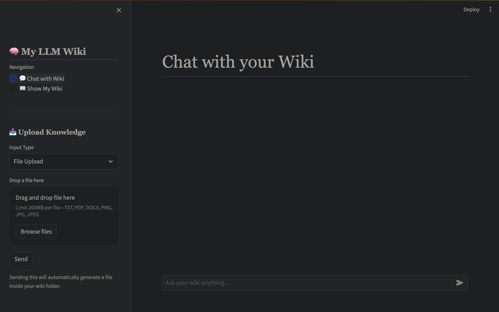

<div align="center">
  <h1>🧠 Personal LLM Wiki</h1>
  <p><em>Your Private Second Brain: An Personal Knowledge base that turns your documents, notes, and PDFs into an interlinked, fully searchable Wikipedia—entirely offline and private.</em></p>
  
  <p>
    <a href="https://github.com/aswin-pn/Personal-wiki-using-Gemma-4/blob/master/LICENSE"></a>
    <a href="https://www.python.org/downloads/"></a>
    <a href="https://ollama.com/"></a>
  </p>
</div>

---

## 🌟 Vision
Imagine a Personal Second brain living in your computer. You drop your research papers, meeting notes, PDFs, and images into a folder, and it instantly categorizes, reads, and writes an interlinked Personal Wikipedia-style article for you. Best of all? **It's 100% private, runs offline, and doesn't send a single byte of your data to the cloud.**

## 📸 Interface


*(Drop your files in the sidebar and start chatting instantly!)*

---

## 🚀 Key Features
- **100% Offline & Private:** Powered by your local LLM via [Ollama](https://ollama.com/). Your personal files stay on your machine.
- **Auto-Ingestion Engine:** Just drop `.pdf`, `.docx`, `.txt`, or `.png` (built-in OCR) into the `raw/` folder. The Watchdog automatically compiles a comprehensive Wiki page.
- **MediaWiki Aesthetics:** A beautifully styled web UI that looks and feels like Wikipedia, complete with markdown rendering and bidirectional link styling.
- **Chat with your Wiki:** Built-in Chatbot that uses local RAG to automatically retrieve pages from your wiki and provide contextual answers.

---

## 🏗️ Architecture Stack

The project relies on a decoupled two-loop architecture: the **Ingestion Engine** (Invisible Librarian) and the **Web Interface**.


---

## 🛠️ Prerequisites

Before you start, ensure you have the following installed:
1. **Python 3.8+**
2. **[Ollama](https://ollama.com/)** (The local LLM runner)
3. **Tesseract OCR** (For image support):
   - **Mac:** `brew install tesseract`
   - **Linux:** `sudo apt install tesseract-ocr`

---

## ⚙️ Installation

**1. Clone the repository:**
```bash
git clone https://github.com/aswin-pn/Personal-wiki-using-Gemma-4.git
cd Personal-wiki-using-Gemma-4
```

**2. Set up the Virtual Environment:**
```bash
python -m venv venv
source venv/bin/activate
pip install -r requirements.txt
```

**3. Pull the Default LLM:**
```bash
ollama pull gemma4:e4b
```

**4. Configuration:**
Copy `.env.example` to `.env` to configure your preferred LLM.
```bash
cp .env.example .env
```

---

## 🎮 Usage 

To run the wiki, you must start both the Librarian and the Web UI in two separate terminals.

> **Terminal 1: Start the Background Librarian**  
> This script watches for incoming files and converts them into Wiki format automatically.
```bash
source venv/bin/activate
python ingest.py
```

> **Terminal 2: Start the Web UI**  
> This is your Wikipedia viewer and Chat UI.
```bash
source venv/bin/activate
streamlit run app.py
```

---

## 🤝 Contributing
Contributions, issues, and feature requests are welcome! Feel free to check the [issues page](https://github.com/aswin-pn/Personal-wiki-using-Gemma-4/issues).

## 📄 License
This project is licensed under the [MIT License](LICENSE).
