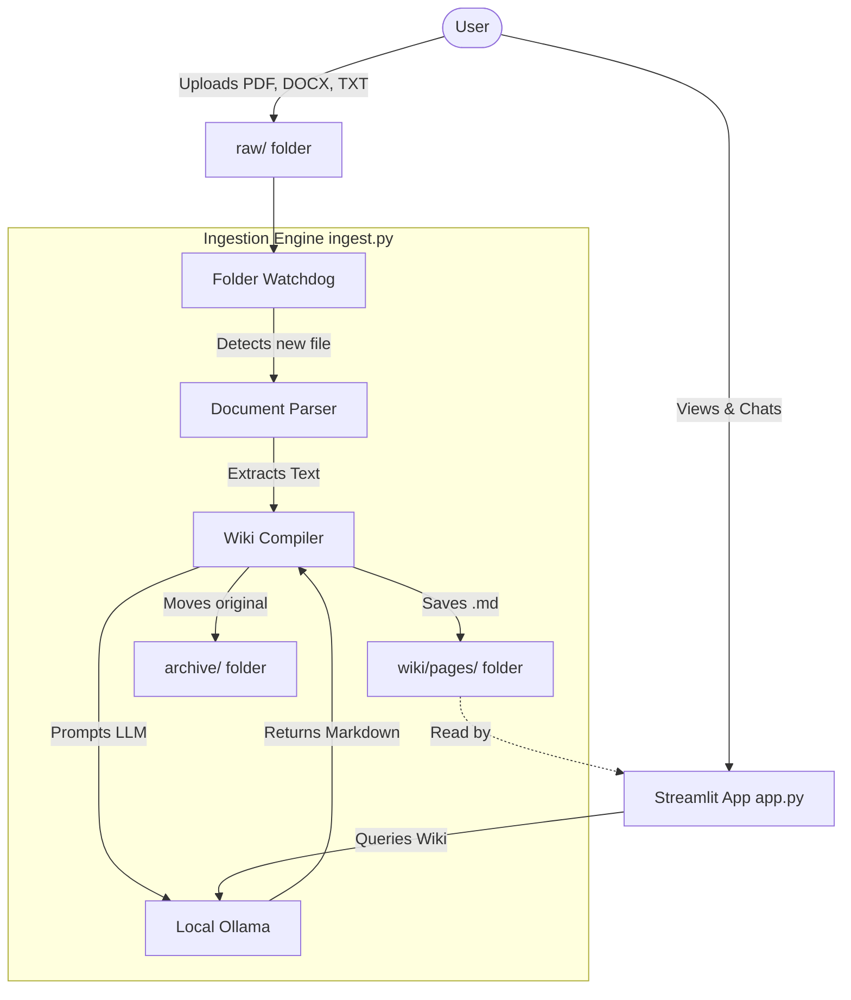

# Personal LLM Wiki 🧠

An invisible local AI librarian that turns your documents, notes, and PDFs into an interlinked, fully searchable Wikipedia—entirely offline and private, powered by Llama 3 (or any local LLM).

## Architecture

The project consists of two main loops: the **Ingestion Engine** (Invisible Librarian) and the **Streamlit Web UI**.



## Features
*   **100% Private:** Using Ollama to run LLMs completely offline. No data is sent to external APIs like OpenAI.
*   **Auto-Ingestion:** Just drop a `.pdf`, `.docx`, `.txt`, `.png` (OCR support) into the `raw/` folder, and the watchdog immediately writes a comprehensive Wiki page for it.
*   **MediaWiki Interface:** Web UI designed to look like a Wikipedia page with markdown rendering and bidirectional link styling.
*   **Chat with Wiki:** Chatbot that automatically retrieves pages from your wiki to ground its answers using local RAG-like behavior.

## Prerequisites

1.  **Python 3.8+**
2.  **Ollama**: Install from [ollama.com](https://ollama.com/)
3.  **Tesseract OCR** (For image parsing):
    *   Mac: `brew install tesseract`
    *   Linux: `sudo apt install tesseract-ocr`

## Installation

1.  **Clone the repository:**
    ```bash
    git clone https://github.com/yourusername/Personal-wiki-using-llama.git
    cd Personal-wiki-using-llama
    ```

2.  **Set up the Virtual Environment & Install Requirements:**
    ```bash
    python -m venv venv
    source venv/bin/activate
    pip install -r requirements.txt
    ```

3.  **Pull the Default LLM (Llama 3):**
    ```bash
    ollama pull llama3
    ```
    *(You can change the model by creating a `.env` file from `.env.example`)*

## Usage

You must run both scripts simultaneously in two separate terminals.

**Terminal 1: Start the Background Librarian**
This script watches for incoming files and converts them in the background.
```bash
python ingest.py
```

**Terminal 2: Start the Web UI**
This is where you browse and chat with your wiki.
```bash
streamlit run app.py
```

## Configuration

We use an environment file (`.env`) for configuration. Copy `.env.example` to `.env` and modify it if you want to use a different model (e.g., `phi3` or `llama3.2-vision`):
```ini
OLLAMA_MODEL=phi3
```

## License

This project is licensed under the MIT License - see the [LICENSE](LICENSE) file for details.
